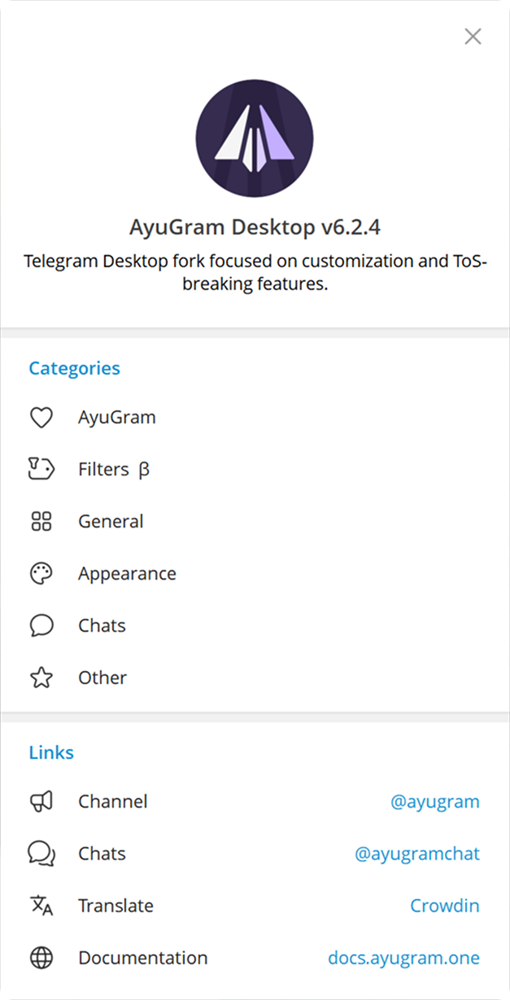
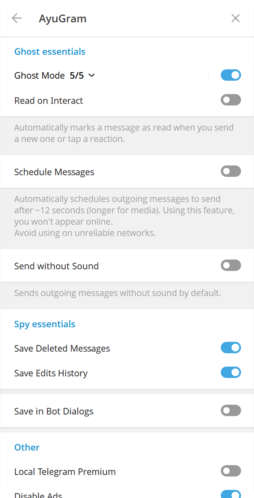
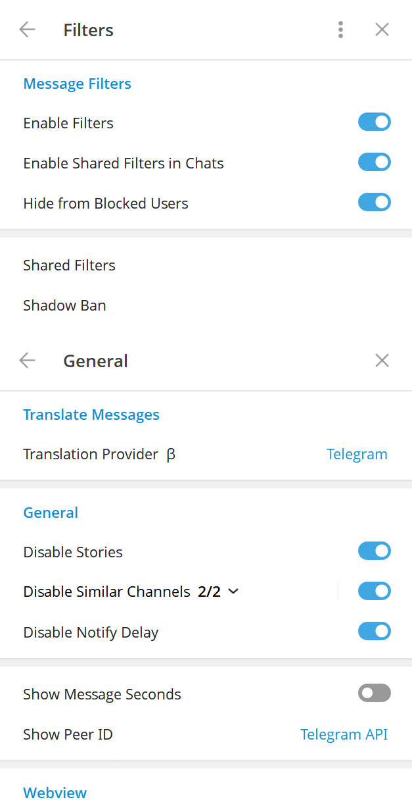
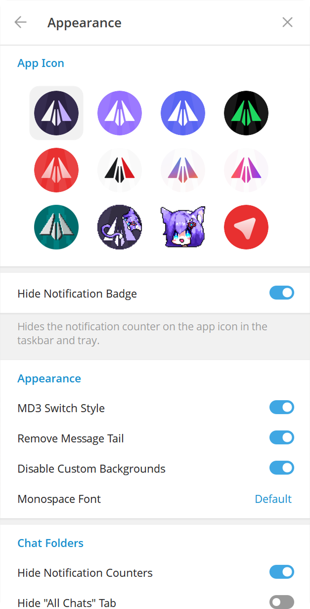

# AyuGram

 

[ [English](README.md)  | Русский ]

## Функции и Фишки

- Полный режим призрака (настраиваемый)
- История удалений и изменений сообщений
- Кастомизация шрифта
- Режим Стримера
- Локальный телеграм премиум
- Превью медиа и быстрая реакция при сильном нажатии на тачпад (macOS)
- Улучшенный вид

И многое другое. Посмотрите нашу [Документацию](https://docs.ayugram.one/desktop/) для более подробной информации.

<h3>
  <details>
    <summary>Скриншоты настроек</summary>
    
    
    
    
  </details>
</h3>

## Установка

### Windows

#### Официальная версия

Вы можете скачать готовый бинарный файл со вкладки [Releases](https://github.com/AyuGram/AyuGramDesktop/releases) или из
[Телеграм канала](https://t.me/AyuGramReleases).

#### Winget

```bash
winget install RadolynLabs.AyuGramDesktop
```

#### Scoop

```bash
scoop bucket add extras
scoop install ayugram
```

#### Сборка вручную

Следуйте [официальному руководству](https://github.com/AyuGram/AyuGramDesktop/blob/dev/docs/building-win-x64.md), если
вы хотите собрать AyuGram сами.

### macOS

#### Официальная версия

Вы можете скачать подписанный пакет со вкладки [Releases](https://github.com/AyuGram/AyuGramDesktop/releases).

#### Homebrew

```bash
brew install --cask ayugram
```

### Arch Linux

#### Из исходников (рекомендованный способ)

Установите `ayugram-desktop` из [AUR](https://aur.archlinux.org/packages/ayugram-desktop).

#### Готовые бинарники

Установите `ayugram-desktop-bin` из [AUR](https://aur.archlinux.org/packages/ayugram-desktop-bin).

Примечание: данный пакет собирается не нами.

### NixOS

Попробуйте [этот репозиторий](https://github.com/ayugram-port/ayugram-desktop).

### ALT Linux

[Sisyphus](https://packages.altlinux.org/en/sisyphus/srpms/ayugram-desktop/)

### EPM

`epm play ayugram`

### Любой другой Линукс дистрибутив

Следуйте [официальному руководству](https://github.com/AyuGram/AyuGramDesktop/blob/dev/docs/building-linux.md).

### Примечания для Windows

Убедитесь что у вас присутствуют эти зависимости:

- C++ MFC latest (x86 & x64)
- C++ ATL latest (x86 & x64)
- последний Windows 11 SDK

## Пожертвования

Вам нравится использовать **AyuGram**? Оставьте нам чаевые!

[Здесь доступные варианты.](https://docs.ayugram.one/donate/)

## Использованные материалы

### Телеграм клиенты

- [Telegram Desktop](https://github.com/telegramdesktop/tdesktop)
- [Kotatogram](https://github.com/kotatogram/kotatogram-desktop)
- [64Gram](https://github.com/TDesktop-x64/tdesktop)
- [Forkgram](https://github.com/forkgram/tdesktop)

### Использованные библиотеки

- [JSON for Modern C++](https://github.com/nlohmann/json)
- [SQLite](https://github.com/sqlite/sqlite)
- [sqlite_orm](https://github.com/fnc12/sqlite_orm)

### Иконки

- [Solar Icon Set](https://www.figma.com/community/file/1166831539721848736)

### Боты

- [TelegramDB](https://t.me/tgdatabase) для получения юзернейма по ID
